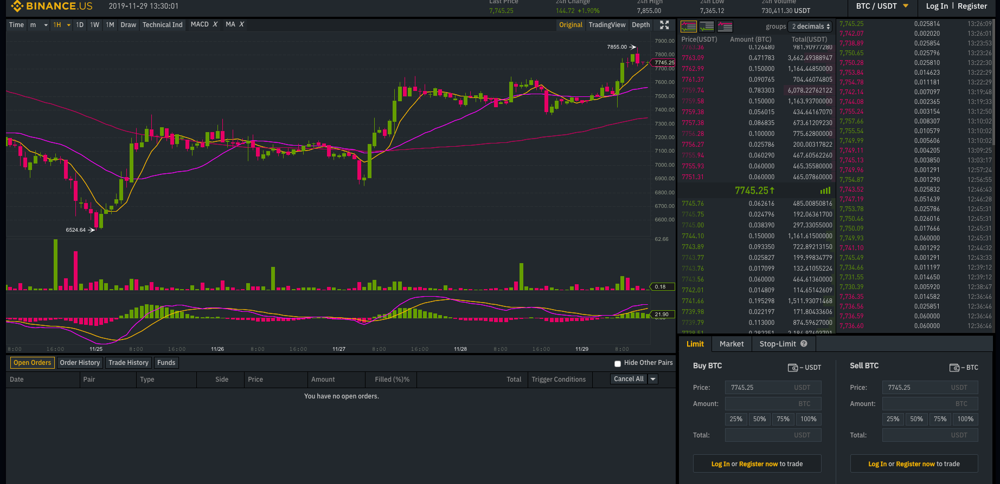

""" Binance Algorithmic Trading """

  

Created to help users set up Algorithmic Trading Platform by using Python with Json and Rest API.

- Connecting to Binance platform through API:
 - Getting information from the market with get function.
 - Calculating necassary parameters for mean-reverting strategy
 - Submitting orders via put function to market when they are profitable
